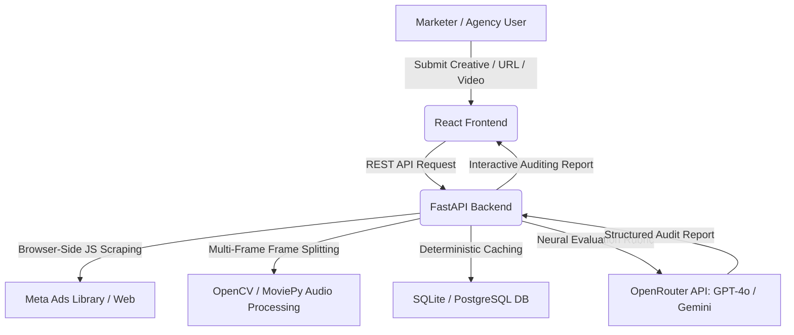

# 🎯 AdVantage AI

### **Next-Gen Neural Marketing Creative Auditor & Cognitive Copywriter**
> Auditing visual ad creatives and copywriting with the analytical depth of an elite performance media director.

[](https://react.dev)
[](https://fastapi.tiangolo.com)
[](https://www.docker.com)
[](https://render.com)
[](https://openrouter.ai)
[](LICENSE)

*   **Live Demo (Frontend)**: [https://advantage-ai-1.onrender.com](https://advantage-ai-1.onrender.com)
*   **Live API Backend**: [https://advantage-ai-naa2.onrender.com/api/v1/advantage/health](https://advantage-ai-naa2.onrender.com/api/v1/advantage/health)
*   **GitHub Repository**: [https://github.com/tahatabassum/advantage-ai](https://github.com/tahatabassum/advantage-ai)

---

## 📖 Problem Statement

Modern performance marketers and growth agencies spend millions of dollars on creative testing. Standard A/B testing is **reactive, slow, and expensive**—requiring weeks of live campaign runtime to identify underperforming hooks, visual friction, or copywriting misalignments. 

### Why This Matters:
*   **Creative Fatigue**: Ad fatigue occurs faster than ever; agencies must rapidly iterate on visual variations.
*   **High Waste**: Media spend is wasted on creatives that fail basic psychological and visual compliance.
*   **Platform Blindspots**: Video ad performance is heavily gated by visual pacing (the first 3 seconds) and call-to-action (CTA) positioning, which simple single-image analyzers miss.

**AdVantage AI** solves this by providing a **deterministic, neural evaluation engine** that pre-audits creatives before they go live, predicting performance and writing high-impact copywriting variants instantly.

---

## ✨ Solution Overview

AdVantage AI ingests images, videos, or raw marketing links (e.g. from the Meta Ads Library) and performs a deep visual, textual, and psychological audit.



### Key Business Value:
*   **90% Reduction in Pre-Launch Creative Risk**: Automatically scores ad creatives on a 100-point rubric assessing Visual Quality, Copy Strength, Platform Fit, and Psychological Triggers.
*   **Pre-Campaign Optimization**: Points out visual and copy changes needed to turn failing grades into top-converting ads.
*   **AI-Powered Copywriting Rewrite**: Generates contextual copy variants (A/B testing ideas) based on the exact visual content of the creative.

---

## 🛠️ Core Features

*   **Image Ad Auditing**: Drag-and-drop static creatives (banners, carousels) for real-time rating and overlay compliance.
*   **High-Fidelity Multi-Frame Video Auditing**:
    *   Extracts chronologically ordered frame checkpoints ($0\% \rightarrow 100\%$ duration) using OpenCV.
    *   Pipes frames sequentially to the Vision LLM in a single request to audit visual pacing, hooks, and CTA presence.
*   **Meta Ads Library Scraper Engine**:
    *   Bypasses geo-blocking (e.g., Pakistan country filters) by automatically force-injecting `country=ALL` query parameters.
    *   Uses Selenium to fetch dynamic page elements.
    *   Solves CORS blocks by performing async browser-side media fetches inside the active Selenium session, passing base64 binaries directly back to Python.
*   **Brand Profile Alignment**: Stores target demographics, industry keywords, competitor analysis, and voice tones to audit ad creative brand compliance.
*   **AI Copywriting Refiner**: Rewrites ad text using contextual creative audit feedback to generate optimized hooks.
*   **Audit History & Analytics Dashboard**: Track and manage past audits, scores, and exports.
*   **PDF Report Generator**: Generates clean, client-facing PDF audit summaries using ReportLab.
*   **Deterministic Persistence**: Caches identical creatives (using SHA-256 asset hashing) combined with a zero-temperature LLM setup to return identical scores.

---

## 🏗️ Technical Architecture & Stack

### System Layout
AdVantage AI uses a monorepo workspace containing a React single-page application and a FastAPI backend service.

```text
├── backend/
│   ├── main.py             # FastAPI Server, endpoints, rate-limit handlers
│   ├── analyzer.py         # AI Gateway, scoring rubrics & system prompts
│   ├── video_analyzer.py   # OpenCV frame extraction, audio wav parser
│   ├── url_analyzer.py     # Selenium controller, blob-scraping & CDN downloaders
│   ├── models.py           # SQLAlchemy database schema models
│   ├── database.py         # DB connection pool (SQLite / PostgreSQL)
│   ├── schemas.py          # Pydantic data schemas
│   └── Dockerfile          # Multi-stage container for Render/Docker deployment
├── frontend/
│   ├── src/
│   │   ├── App.tsx         # Main layout & authentication state container
│   │   ├── components/     # UI panels (Upload, History, Dashboard)
│   │   └── services/       # Axios API client wrapper
│   └── package.json
└── package.json            # Root dev workspace script
```

### Detailed Tech Stack Breakdown

| Technology | Purpose | Why Chosen |
| :--- | :--- | :--- |
| **FastAPI** | Backend Web API | High-performance async request handling, automated Pydantic schema validation, and low footprint. |
| **React 19 & TS** | Frontend Web Application | Single-page UI state management, typing safety, and reactive components for dashboard score displays. |
| **Selenium (uc)** | Dynamic Page Scraping | Standard scraping fails on Meta Ads Library's client-side React code. Selenium + Undetected-Chromedriver renders client-side JS. |
| **OpenCV** | Frame Extraction | Allows precise frame checkpoint extraction ($0\%, 20\%, 40\%, \dots$) to reconstruct video progression for the Vision LLM. |
| **PostgreSQL & SQLite**| Data Storage | Default SQLite for zero-config local development; automatic switch to PostgreSQL in production environments. |
| **SQLAlchemy** | Database ORM | Abstract database dialect differences (e.g. SQLite to PostgreSQL) preventing migration rewrites. |
| **Docker** | Containerization | Packages backend Python requirements along with Google Chrome stable binaries, ensuring Selenium works out of the box in production. |
| **ReportLab** | PDF Generation | Allows dynamic, client-ready PDF generation of ad reports on the fly directly inside the backend. |

---

## 🤖 AI Engine & Engineering decisions

*   **Multi-Modal Gateway**: Connects via OpenRouter to access state-of-the-art models like **Gemini 2.0 Flash** and **GPT-4o-mini**, selecting models dynamically based on media inputs.
*   **Sequential Visual Prompting**: For video audits, prompts the Vision model with sequentially-labeled frames. Instructs it to check:
    *   *Frame 1 (0%):* Hook strength, branding presence, and readability.
    *   *Frames 2-5 (20%-80%):* Pacing, visual flow, and transition smoothness.
    *   *Frame 6 (100%):* Presence and positioning of the Call-To-Action (CTA).
*   **Zero-Temperature Deterministic Scoring**: Set model temperature to `0.0` and combine it with SHA256 input hashing to ensure identical ad creatives return identical scores.

---

## 🛠️ Engineering Tradeoffs & Design Decisions

### 1. Docker-Based Google Chrome Package vs. Serverless
Running Selenium inside a serverless setup is notoriously unstable due to missing browser dependencies. By writing a custom `Dockerfile` that downloads and installs `google-chrome-stable` directly inside the container, we guarantee that Selenium works identical in dev, staging, and production.

### 2. V8 Memory Heap Caps for Low-Resource Environments
On Render's Free tier (512MB RAM), starting standard Chrome easily triggers an Out-Of-Memory (OOM) crash. We resolved this by configuring Chrome with memory optimization flags (e.g. `--js-flags=--max-old-space-size=256` and disabling software rasterization/extensions) to keep memory usage under 256MB.

### 3. Client-Side Blob Fetching vs. Server-Side Downloads
Meta Ads Library prevents direct server-side video downloads using tokenized, ephemeral URLs. To bypass this, we execute an async Javascript fetch script *directly inside the active Chrome session* managed by Selenium. The browser downloads the media as a blob, converts it to base64, and returns the data back to Python.

---

## 💻 Developer Setup & Installation

### 1. Prerequisites
Ensure you have **Node.js (v18+)**, **Python (3.10+)**, and **Google Chrome** installed.

### 2. Configure Environment
Create a `.env` file in the root directory:
```env
# OpenRouter API Key
OPENROUTER_API_KEY=your-api-key-here

# JWT authentication secret
JWT_SECRET_KEY=your-custom-jwt-secret-key

# Database URL (Defaults to SQLite if left blank)
DATABASE_URL=sqlite:///./advantage_ai.db

# Admin configuration key (for DB resets)
ADMIN_SECRET=your-admin-secret-key
```

### 3. Install Dependencies & Build
Run the following from the root directory:
```bash
# Install Node devDependencies & packages
npm install

# Install Python requirements
pip install -r requirements.txt
```

### 4. Run Locally
To spin up both Vite (frontend) and Uvicorn (backend) concurrently, run:
```bash
npm run dev
```
*   **Frontend UI**: `http://localhost:3001`
*   **Backend Swagger Docs**: `http://localhost:8000/docs`

---

## 🚀 Deployment

### Frontend (Render Static Site)
*   **Build Command**: `npm run build`
*   **Publish Directory**: `dist` (pointing the Root Directory to `frontend`)
*   **Environment Variable**: `VITE_API_URL` pointing to the deployed backend.

### Backend (Render Web Service via Docker)
*   **Runtime**: Docker (Render detects the `Dockerfile` inside `backend/`)
*   **Environment Variables**: Configured with `OPENROUTER_API_KEY`, `JWT_SECRET_KEY`, and `ALLOWED_ORIGINS` (set to your frontend's URL).

---

## 📈 Future Roadmap

*   **Multi-Agent Auditing workflows**: Route ad creatives through separate specialized agent nodes (e.g., Compliance Agent, Design Consistency Agent, Psychological Trigger Specialist) to compile a combined audit.
*   **Vector DB Audit Search**: Store visual creative embeddings (using CLIP) in a vector database to search previous audits for similar visual components and find correlations with performance.
*   **Auditing Brand Logo & Guidelines**: Allow users to upload corporate logo assets and brand manuals to automatically audit ad compliance.

---

## 🎯 Portfolio Significance

This project demonstrates deep full-stack engineering and advanced AI integration, moving past simple API wrappers:
*   **Complex Scraping Pipelines**: Hand-coded Selenium control scripts, client-side blob fetches, and geofilter bypassing.
*   **Advanced Multi-Modal Data Pipelines**: OpenCV video slicing and multi-frame prompt packaging.
*   **Resilient DevOps practices**: Docker-based Chrome builds, low-memory browser optimizations, and automatic multi-dialect database mappings.
